<div align="center">

<h1> Neural Spike Train Analysis </h1>

[](https://python.org)
[](https://fastapi.tiangolo.com)
[](https://docs.pytorch.org/docs/stable/index.html)
[](https://numpy.org/doc/)
[](https://scikit-learn.org/stable/)
[](https://docker.com)
[](LICENSE)
[](https://docs.astral.sh/ruff/)

</div>

## Overview

Spike trains are time-series electrical signals (action potentials) generated by neurons to communicate with each other. Because all spikes have similar shape and amplitude, information is encoded in the timing of spikes rather than their size—making neural signaling a form of pulse-based, time-coded communication. 

Mathematically, spike trains are modeled as point processes, where each spike is treated as a discrete event in time. This simplifies analysis and enables precise modeling of neural activity. Physiologically, spike train analysis helps infer how neural circuits function by extracting patterns and relationships from recorded spike data.

This project implements a fully reproducible, containerized ML pipeline purpose-built for neural signal data. It transforms raw electrophysiological recordings into real-time model predictions through five clearly separated, independently testable stages.

**Key design goals:**

- **Reproducibility** — any past experiment can be re-run exactly using DVC data locks + Hydra config snapshots + git commits
- **No training/serving skew** — the same serialized sklearn `Pipeline` object that fits during training is loaded verbatim at inference time
- **Decoupled training and serving** — models are promoted to a champion alias in the MLflow registry; the API loads `@champion` on startup with no code changes required
- **Observable experiments** — every training run logs parameters, metrics, artifacts, and the confusion matrix to MLflow automatically

**Supported signal formats:** EDF, BDF, CSV (MNE-compatible)

**Supported tasks:** Binary and multi-class neural signal classification (motor imagery BCI, sleep staging, seizure detection, spike sorting)

---

## Architecture

```
┌─────────────────────────────────────────────────────────────────────┐
│                         Prefect Orchestration                       │
│                                                                     │
│  ┌───────────┐   ┌──────────────┐   ┌───────────┐   ┌──────────┐    │
│  │ Ingestion │──▶│Preprocessing │──▶│ Features  │──▶│ Training │    │
│  │  stage 1  │   │   stage 2    │   │  stage 3  │   │ stage 4  │    │
│  └───────────┘   └──────────────┘   └───────────┘   └────┬─────┘    │
│       │                                                    │        │
│  DVC data store                                     MLflow Registry │
└───────┼────────────────────────────────────────────────────┼────────┘
        │                                                    │
   Raw signals                                        Champion model
   (EDF/BDF/CSV)                                            │
                                                            ▼
                                                   ┌──────────────────┐
                                                   │  FastAPI  stage 5│
                                                   │  /predict        │
                                                   │  /health         │
                                                   └──────────────────┘
```

The feature extraction `Pipeline` object is **serialized alongside the model** in MLflow — it is loaded and run identically during both training evaluation and live inference, eliminating the leading source of silent failure in signal processing systems.


---

## Tech Stack

| Layer | Technology | Purpose |
|---|---|---|
| Signal processing | [MNE-Python](https://mne.tools/) | EEG/ERP reading, filtering, ICA, epoching |
| Feature extraction | SciPy, NumPy, PyWavelets | PSD, wavelets, statistical features |
| ML framework | scikit-learn, PyTorch + skorch | Classical + deep models (EEGNet, TCN) |
| Pipeline orchestration | [Prefect 2](https://www.prefect.io/) | Flow scheduling, retries, observability |
| Experiment tracking | [MLflow](https://mlflow.org/) | Run tracking, model registry, artifact store |
| Config management | [Hydra](https://hydra.cc/) | Composable, CLI-overridable experiment configs |
| Data versioning | [DVC](https://dvc.org/) | Tracks raw signal files without bloating git |
| Data validation | [Great Expectations](https://greatexpectations.io/) | Schema + range contracts on ingested data |
| API serving | [FastAPI](https://fastapi.tiangolo.com/) + Uvicorn | Async REST API, auto OpenAPI docs |
| Containerization | Docker + Docker Compose | Reproducible environments, lean inference image |
| Testing | pytest + pytest-cov | Unit, integration, synthetic signal fixtures |
| Linting / typing | Ruff, mypy | Code quality, type safety |

---


## Getting Started

### Prerequisites

- Python 3.12+
- Docker & Docker Compose
- [DVC](https://dvc.org/doc/install) (`pip install dvc`)
- [Prefect 2](https://docs.prefect.io/) (`pip install prefect`)
- Access to a DVC remote (S3, GCS, Azure Blob, or local path)

### Installation

```bash
# Clone the repository
git clone https://github.com/your-org/neural-ml-pipeline.git
cd neural-ml-pipeline

# Create and activate a virtual environment
python -m venv .venv
source .venv/bin/activate   # Windows: .venv\Scripts\activate

# Install all dependencies (including dev tools)
pip install -e ".[dev]"
```

### Data Setup with DVC

```bash
# Configure your DVC remote (example: local path)
dvc remote add -d myremote /path/to/your/dvc/store

# Pull tracked data assets
dvc pull

# Verify data integrity
dvc status
```

To add your own raw signal files:

```bash
cp /path/to/your/signals.edf data/raw/
dvc add data/raw/signals.edf
git add data/raw/signals.edf.dvc .gitignore
git commit -m "feat: add raw signal dataset"
dvc push
```

---

## Pipeline Stages



### 1. Data Ingestion

Reads raw neural recordings in EDF, BDF, or CSV format into MNE `Raw` objects and validates them against data contracts.

```python
from src.ingestion.loader import load_raw_signal
from src.ingestion.validator import validate_signal

raw = load_raw_signal("data/raw/subject_01.edf")
validate_signal(raw)  # raises DataValidationError on contract violation
```

**Validation contracts (Great Expectations):**
- Expected channel names and count
- Sampling frequency within acceptable range
- No all-zero or flat channels
- Signal amplitude within physiological bounds

### 2. Signal Preprocessing

Applies a standard EEG preprocessing chain. All parameters are Hydra-configurable.

```python
from src.preprocessing.filters import apply_bandpass, apply_notch
from src.preprocessing.epochs import segment_epochs
from src.preprocessing.artifacts import reject_artifacts_ica

raw_filtered = apply_bandpass(raw, l_freq=1.0, h_freq=40.0)
raw_filtered = apply_notch(raw_filtered, freqs=[50.0])
epochs = segment_epochs(raw_filtered, event_id={"motor_left": 1, "motor_right": 2})
epochs_clean = reject_artifacts_ica(epochs, n_components=20)
```

**Default preprocessing chain:**
- Bandpass filter: 1–40 Hz (configurable)
- Notch filter: 50 Hz / 60 Hz (configurable per region)
- Re-referencing: average reference
- Epoch segmentation: event-locked windows
- Baseline correction: pre-stimulus interval
- Artifact rejection: ICA with EOG/ECG component detection

### 3. Feature Extraction

All extractors are wrapped in a single serializable sklearn `Pipeline` — the same object is used in training and inference.

```python
from src.features.pipeline import build_feature_pipeline

pipeline = build_feature_pipeline(config)
X = pipeline.fit_transform(epochs_clean)   # training
X = pipeline.transform(epochs_new)         # inference (no refit)
```

**Available feature extractors:**

| Module | Features |
|---|---|
| `spectral.py` | PSD via Welch method, band power (δ, θ, α, β, γ) |
| `temporal.py` | ERP amplitude/latency, mean, variance, skewness, kurtosis |
| `spatial.py` | CSP spatial filters, covariance matrix features |

### 4. Model Training & Evaluation

Every training run is fully tracked in MLflow. Start a run:

```bash
# Train with default config
make train

# Override model type and hyperparameters via CLI (Hydra)
python flows/training_flow.py model=svm model.C=10.0 model.kernel=rbf

# Train with EEGNet deep model
python flows/training_flow.py model=eegnet model.epochs=100 model.lr=0.001
```

**What gets logged to MLflow automatically:**
- All Hydra config parameters
- Cross-validation scores (accuracy, F1, AUC-ROC, Cohen's kappa)
- Confusion matrix as a figure artifact
- Serialized `sklearn.Pipeline` + model as a registered artifact
- Training duration and system metadata

To promote a run to the production champion:

```bash
python src/training/register.py --run-id <mlflow_run_id>
```

### 5. Inference API

The FastAPI app loads the `@champion` model from MLflow on startup. Send a raw signal array and receive a prediction.

```bash
# Start the API locally
make serve

# Or with Docker
docker compose up api
```

**Example prediction request:**

```bash
curl -X POST http://localhost:8000/predict \
  -H "Content-Type: application/json" \
  -d '{
    "signal": [[0.12, -0.34, 0.56, ...], ...],
    "sampling_rate": 250,
    "channels": ["Fp1", "Fp2", "C3", "C4", "O1", "O2"]
  }'
```

**Response:**

```json
{
  "prediction": "motor_left",
  "probabilities": {
    "motor_left": 0.83,
    "motor_right": 0.17
  },
  "model_version": "2",
  "latency_ms": 18.4
}
```

---

## Configuration

All pipeline parameters are managed by [Hydra](https://hydra.cc/). The root config at `configs/config.yaml` composes sub-configs for each stage.

**Example: `configs/preprocessing/default.yaml`**

```yaml
bandpass:
  l_freq: 1.0
  h_freq: 40.0

notch:
  freqs: [50.0]

epochs:
  tmin: -0.2
  tmax: 0.8
  baseline: [-0.2, 0.0]

ica:
  n_components: 20
  method: fastica
  random_state: 42
```

Override any parameter from the CLI without modifying files:

```bash
python flows/training_flow.py \
  preprocessing.bandpass.h_freq=100.0 \
  model=eegnet \
  model.lr=0.0005
```

All overrides are captured in the MLflow run parameters automatically.

---

## Experiment Tracking

Start the MLflow UI to inspect experiments:

```bash
mlflow ui --backend-store-uri ./mlruns --port 5000
```

Or via Docker Compose (recommended):

```bash
docker compose up mlflow
# UI available at http://localhost:5000
```

**Comparing runs programmatically:**

```python
import mlflow

client = mlflow.MlflowClient()
runs = client.search_runs(
    experiment_ids=["1"],
    order_by=["metrics.val_f1 DESC"],
    max_results=10
)
for run in runs:
    print(run.info.run_id, run.data.metrics["val_f1"])
```

---

## Running the Pipeline

### Full Training Pipeline

```bash
# Run the complete pipeline: ingest → preprocess → features → train → register
make train

# Or run the Prefect flow directly
python flows/training_flow.py

# Reproduce any past DVC-tracked pipeline run
dvc repro
```

### Serving Predictions

```bash
# Local development server (auto-reload)
make serve

# Production server
uvicorn src.api.main:app --host 0.0.0.0 --port 8000 --workers 4
```

### API Reference

| Endpoint | Method | Description |
|---|---|---|
| `/predict` | `POST` | Run inference on a signal array |
| `/health` | `GET` | Liveness check |
| `/ready` | `GET` | Readiness check (model loaded) |
| `/docs` | `GET` | Auto-generated OpenAPI documentation |
| `/metrics` | `GET` | Prometheus-compatible metrics |

Interactive API docs available at `http://localhost:8000/docs` when the server is running.

---

## Docker Deployment

Two purpose-built images are provided:

| Image | Base | Size | Contents |
|---|---|---|---|
| `Dockerfile.train` | `python:3.12` | ~3.5 GB | MNE, PyTorch, scikit-learn, MLflow, Prefect |
| `Dockerfile.api` | `python:3.12-slim` | ~500 MB | FastAPI, numpy, scipy, MLflow client only |

**Start all services:**

```bash
docker compose up
```

This brings up:
- `api` — FastAPI inference server on port `8000`
- `mlflow` — MLflow tracking server on port `5000`
- `prefect-agent` — Prefect worker for orchestrated runs

**Build images manually:**

```bash
# Training image
docker build -f docker/Dockerfile.train -t neural-pipeline:train .

# Inference image
docker build -f docker/Dockerfile.api -t neural-pipeline:api .
```

**Environment variables (`.env` file or Docker secrets):**

```env
MLFLOW_TRACKING_URI=http://mlflow:5000
DVC_REMOTE_URL=s3://your-bucket/dvc-store
AWS_ACCESS_KEY_ID=...
AWS_SECRET_ACCESS_KEY=...
```

---

## Testing

```bash
# Run all tests with coverage
make test

# Unit tests only
pytest tests/unit/ -v

# Integration tests (requires Docker services running)
pytest tests/integration/ -v --timeout=120

# Coverage report
pytest --cov=src --cov-report=html
open htmlcov/index.html
```

**Synthetic signal fixtures** are available in `tests/conftest.py` for testing without real data:

```python
# In your test file
def test_bandpass_filter(synthetic_eeg):
    # synthetic_eeg is a valid MNE Raw object with 64 channels at 250 Hz
    filtered = apply_bandpass(synthetic_eeg, l_freq=1.0, h_freq=40.0)
    assert filtered.info["sfreq"] == 250
```

---

## Reproducibility Guarantee

A given experiment is fully reproducible if you have:

1. **The git commit** — pins all source code and configs
2. **`dvc.lock`** — pins the exact data files and their hashes
3. **`params.yaml`** — pins the parameter snapshot used by DVC stages
4. **The MLflow run ID** — pins logged artifacts and metrics

To reproduce any past training run:

```bash
git checkout <commit-sha>
dvc checkout          # restores exact data state from dvc.lock
dvc repro             # reruns pipeline with locked params
```

> !!! The feature extraction `Pipeline` in `src/features/pipeline.py` must remain serialization-safe (no lambdas, no unpicklable closures). This is enforced by an integration test that round-trips the pipeline through `mlflow.sklearn.log_model` / `load_model`.

---

## Development Guide

```bash
# Install dev dependencies
pip install -e ".[dev]"

# Run linter
ruff check src/ tests/

# Type checking
mypy src/

# Format code
ruff format src/ tests/

# Pre-commit hooks (recommended)
pre-commit install
```

**Adding a new feature extractor:**

1. Implement a scikit-learn compatible transformer in `src/features/your_extractor.py`
   ```python
   from sklearn.base import BaseEstimator, TransformerMixin

   class YourExtractor(BaseEstimator, TransformerMixin):
       def fit(self, X, y=None): return self
       def transform(self, X): ...
   ```
2. Register it in `src/features/pipeline.py` under the appropriate config key
3. Add a config entry under `configs/features/`
4. Write unit tests in `tests/unit/features/test_your_extractor.py`

**Adding a new model:**

1. Add a Hydra config to `configs/model/your_model.yaml`
2. Add a factory branch in `src/training/train.py`
3. If deep learning: implement in PyTorch, wrap with `skorch.NeuralNetClassifier`

---

## Contributing

1. Fork the repository and create a feature branch: `git checkout -b feat/your-feature`
2. Write tests for new functionality
3. Ensure `make test` passes with >80% coverage
4. Run `ruff check` and `mypy src/` with no errors
5. Submit a pull request with a clear description of the change

Please open an issue before starting work on large features.

---

## License

MIT License — see [LICENSE](LICENSE) for details.

---

<div align="center">
  <sub>Built for reproducible neuroscience ML. Issues and PRs welcome.</sub>
</div>
>>>>>>> dba3f4b (initial commit and setup project architecture)
