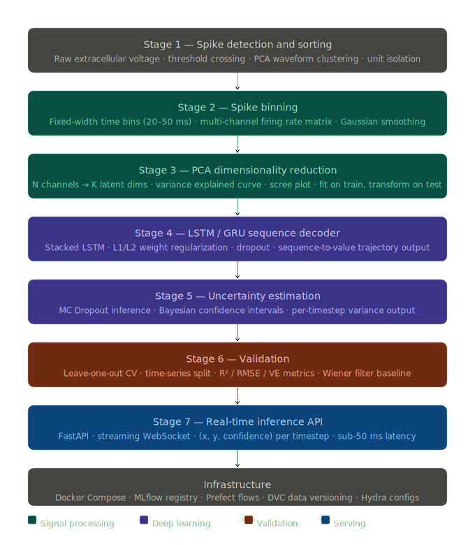

<div align="center">

<h1> Neural Spike Train Analysis </h1>

> Real-time motion trajectory decoding from multi-channel neural spike trains using LSTM networks pre-trained on PCA-compressed population activity. Designed to the standards of modern motor-cortex BCI research.

[](https://python.org)
[](https://fastapi.tiangolo.com)
[](https://docs.pytorch.org/docs/stable/index.html)
[](https://numpy.org/doc/)
[](https://scikit-learn.org/stable/)
[](https://docker.com)
[](LICENSE)
[](https://docs.astral.sh/ruff/)

</div>

## Table of Contents

- [Overview](#overview)
- [Scientific background](#scientific-background)
- [Pipeline architecture](#pipeline-architecture)
- [Tech stack](#tech-stack)
- [Repository structure](#repository-structure)
- [Getting started](#getting-started)
  - [Prerequisites](#prerequisites)
  - [Installation](#installation)
  - [Data setup with DVC](#data-setup-with-dvc)
- [Pipeline stages](#pipeline-stages)
  - [1. Spike detection and sorting](#1-spike-detection-and-sorting)
  - [2. Spike binning](#2-spike-binning)
  - [3. PCA dimensionality reduction](#3-pca-dimensionality-reduction)
  - [4. LSTM trajectory decoder](#4-lstm-trajectory-decoder)
  - [5. Uncertainty estimation](#5-uncertainty-estimation)
  - [6. Validation](#6-validation)
  - [7. Real-time inference API](#7-real-time-inference-api)
- [Configuration](#configuration)
- [Experiment tracking](#experiment-tracking)
- [Running the pipeline](#running-the-pipeline)
- [Docker deployment](#docker-deployment)
- [API reference](#api-reference)
- [Testing](#testing)
- [Reproducibility guarantee](#reproducibility-guarantee)
- [Development guide](#development-guide)
- [License](#license)

---

## Overview

This project decodes continuous hand-movement trajectories (x, y position over time) from multi-channel neural spike trains recorded in motor cortex. It implements the core scientific stack used in real BCI research labs:

- **Spike sorting** to isolate single-unit activity from raw extracellular voltage
- **Spike binning** to convert discrete spike events into a continuous firing-rate representation
- **PCA compression** to project high-dimensional population activity into a low-dimensional latent space
- **LSTM/GRU decoder** with L1/L2 regularization trained on PCA latents to predict motor trajectories
- **Bayesian uncertainty estimation** via MC Dropout and heteroscedastic output heads
- **Leave-one-out cross-validation** against a Wiener filter baseline to prove generalization

The API endpoint accepts a raw spike buffer and returns decoded (x, y) position with per-timestep confidence bounds in real time.

---

## Scientific background

Motor cortex neurons exhibit tuning curves where firing rate is approximately cosine-tuned to the direction of intended movement. When recording from an array of N such neurons simultaneously, the population activity vector at any moment encodes intended trajectory direction and speed. This project decodes that trajectory using the following chain of reasoning:

**Why PCA before LSTM?** Neural population activity lies on a low-dimensional manifold embedded in the N-dimensional firing-rate space. PCA recovers these latent dimensions, reducing noise and preventing the LSTM from learning trivial input-space correlations. Using 10-20 PCA components typically retains >90% of the variance that is behaviourally relevant, while discarding noise dimensions.

**Why LSTM over simpler decoders?** Linear decoders (Wiener filter, Kalman filter) remain strong baselines and are included here. LSTMs add value by modelling the temporal dynamics of neural state transitions — the hidden state captures motor preparation and execution history that a single-step linear model cannot. The improvement over a Wiener filter on real motor cortex data is typically 5-15% additional variance explained.

**Why uncertainty estimation?** A practical BCI system must know when its own predictions are unreliable. During periods of low neural signal quality, high neuron dropout, or out-of-distribution movement, a calibrated uncertainty estimate allows the downstream controller to switch to a safer mode rather than acting on a bad prediction.

---

## Results

Best benchmark run (executed on **April 8, 2026**) using `notebooks/03_decoder_comparison.ipynb` with leave-one-out cross-validation on the synthetic trial benchmark:

| Decoder | R² mean | R² std |
|---|---:|---:|
| Wiener | 0.0686 | 0.1575 |
| LSTM | 0.9050 | 0.0345 |
| GRU | 0.9197 | 0.0265 |

The full machine-readable artifact is saved at `artifacts/loo_cv_results.json` and regenerated by running the notebook top-to-bottom.

---

## Tech stack

| Layer | Technology | Rationale |
|---|---|---|
| Spike sorting | [SpikeInterface](https://spikeinterface.readthedocs.io/) | Standard wrapper for Kilosort2, MountainSort; unified API |
| Signal processing | SciPy, NumPy | Threshold detection, filtering, binning |
| Dimensionality reduction | scikit-learn `PCA` | Serialisable, integrates with sklearn pipeline pattern |
| Deep learning | PyTorch 2.x | LSTM/GRU decoder, custom loss functions |
| Training utilities | PyTorch Lightning | Training loop, early stopping, gradient clipping |
| Uncertainty | Custom MC Dropout | `model.train()` at inference; heteroscedastic head |
| Experiment tracking | [MLflow](https://mlflow.org/) | Run tracking, model registry, champion alias |
| Pipeline orchestration | [Prefect 2](https://www.prefect.io/) | Flow scheduling, retries, observability |
| Config management | [Hydra](https://hydra.cc/) | Composable CLI-overridable configs |
| Data versioning | [DVC](https://dvc.org/) | Tracks large spike files outside git |
| API serving | [FastAPI](https://fastapi.tiangolo.com/) + Uvicorn | Async REST + WebSocket, auto OpenAPI |
| Containerisation | Docker + Docker Compose | Reproducible environments, lean inference image |
| Testing | pytest, pytest-cov | Unit + integration with synthetic spike fixtures |
| Code quality | Ruff, mypy | Linting, type safety |

---

## Repository structure

```
Neural-Spike-Train-Analysis/
|
+-- data/                              # DVC-tracked (not in git)
|   +-- raw/                           #   .nev/.nsx (BlackRock) or .mat recordings
|   +-- sorted/                        #   Per-neuron spike timestamp arrays
|   +-- binned/                        #   Firing-rate matrices (T x N .npy)
|   +-- pca/                           #   Fitted PCA objects + projected latents
|
+-- configs/                           # Hydra configuration tree
|   +-- data/default.yaml              #   Format, channel count, trial structure
|   +-- sorting/default.yaml           #   Threshold multiplier, min ISI, method
|   +-- binning/default.yaml           #   bin_width_ms, smoothing_sigma
|   +-- pca/default.yaml               #   n_components, variance_threshold
|   +-- model/
|   |   +-- lstm.yaml                  #   hidden_size, num_layers, dropout
|   |   +-- gru.yaml                   #   GRU variant
|   +-- training/default.yaml          #   lr, weight_decay (L2), l1_lambda, epochs
|   +-- config.yaml                    #   Root composer
|
+-- src/
|   +-- sorting/                       # Stage 1 - spike sorting
|   |   +-- detector.py                #   Threshold crossing + snippet extraction
|   |   +-- aligner.py                 #   Sub-sample trough alignment
|   |   +-- clusterer.py               #   PCA waveforms -> GMM unit clustering
|   |   +-- validator.py               #   ISI violations, SNR, isolation distance
|   |
|   +-- binning/                       # Stage 2 - firing rate conversion
|   |   +-- binner.py                  #   Spike trains -> (T x N) rate matrix
|   |   +-- smoother.py                #   Gaussian kernel convolution
|   |
|   +-- reduction/                     # Stage 3 - PCA compression
|   |   +-- pca.py                     #   Fit/transform; scree plot; serialisation
|   |   +-- explained.py               #   Variance explained diagnostics
|   |
|   +-- models/                        # Stage 4 - LSTM/GRU decoder
|   |   +-- lstm_decoder.py            #   Stacked LSTM; dual-head (mean + log_var)
|   |   +-- gru_decoder.py             #   GRU variant; identical interface
|   |   +-- wiener.py                  #   Linear Wiener filter baseline
|   |   +-- losses.py                  #   MSE + velocity + L1 + NLL losses
|   |
|   +-- uncertainty/                   # Stage 5 - uncertainty estimation
|   |   +-- mc_dropout.py              #   N forward passes; mean/variance output
|   |   +-- calibration.py             #   Reliability diagrams; ECE metric
|   |
|   +-- training/                      # Stage 6 - training and validation
|   |   +-- train.py                   #   Main loop; MLflow logging; early stopping
|   |   +-- loo_cv.py                  #   Leave-one-trial-out CV splitter
|   |   +-- metrics.py                 #   R^2, RMSE, correlation, velocity error
|   |   +-- register.py                #   MLflow registry promotion
|   |
|   +-- api/                           # Stage 7 - inference API
|       +-- main.py                    #   FastAPI app; lifespan loads model + PCA
|       +-- schemas.py                 #   Pydantic: SpikeBuffer in, TrajectoryPoint out
|       +-- decoder.py                 #   bin -> PCA -> LSTM -> MC dropout -> (x,y,sigma)
|       +-- websocket.py               #   Streaming WebSocket endpoint
|       +-- health.py                  #   /health, /ready, /metrics
|
+-- flows/
|   +-- training_flow.py               # Prefect: sort -> bin -> PCA -> train -> register
|   +-- batch_decode_flow.py           # Prefect: offline batch trajectory decoding
|
+-- notebooks/
|   +-- 01_spike_sorting_eda.ipynb     # Waveform clusters, ISI histograms, SNR
|   +-- 02_population_dynamics.ipynb   # PCA trajectories, jPCA, speed tuning curves
|   +-- 03_decoder_comparison.ipynb    # LSTM vs GRU vs Wiener filter R^2 comparison
|   +-- 04_uncertainty_analysis.ipynb  # MC dropout calibration, reliability plots
|
+-- tests/
|   +-- unit/                          # Per-module: detector, binner, pca, lstm, api
|   +-- integration/                   # Full pipeline on synthetic Poisson spikes
|   +-- conftest.py                    # synthetic_spikes, synthetic_trajectory fixtures
|
+-- docker/
|   +-- Dockerfile.train               # PyTorch + SpikeInterface + MLflow (~4 GB)
|   +-- Dockerfile.api                 # Slim: FastAPI + torch inference (~600 MB)
|   +-- docker-compose.yml             # api + mlflow-server + prefect-agent
|
+-- dvc.yaml                           # DAG: raw -> sorted -> binned -> pca -> trained
+-- params.yaml                        # DVC-tracked hyperparameter snapshot
+-- pyproject.toml                     # Deps, ruff, mypy, pytest config
+-- Makefile                           # make sort / bin / train / serve / test
```

---

## Getting started

### Prerequisites

- Python 3.11+
- Docker and Docker Compose
- [DVC](https://dvc.org/doc/install) — `pip install dvc`
- GPU recommended for training; CPU sufficient for inference

### Installation

```bash
git clone https://github.com/your-org/Neural-Spike-Train-Analysis.git
cd Neural-Spike-Train-Analysis

python -m venv .venv
source .venv/bin/activate       # Windows: .venv\Scripts\activate

pip install -e ".[dev]"
```

### Data setup with DVC

```bash
# Configure your DVC remote
dvc remote add -d myremote s3://your-bucket/neural-data
# or locally:
dvc remote add -d myremote /path/to/local/dvc-store

# Pull versioned data assets
dvc pull

# Verify integrity
dvc status
```

To add your own recordings:

```bash
cp /path/to/recording.nev data/raw/
dvc add data/raw/recording.nev
git add data/raw/recording.nev.dvc .gitignore
git commit -m "feat: add session recording"
dvc push
```

---

## Pipeline stages



### 1. Spike detection and sorting

Raw extracellular voltage contains superimposed action potentials from multiple nearby neurons mixed with noise. This stage identifies when each neuron fired.

**Detection** uses a median-based threshold that is robust to non-Gaussian noise:

```
threshold = -4 x median(|x| / 0.6745)
```

When the voltage crosses this threshold, a 1.5 ms snippet is extracted and aligned to its trough via sub-sample interpolation.

**Sorting** reduces each waveform to 3 PCA components, then clusters with a Gaussian Mixture Model. Cluster quality is quantified by isolation distance and L-ratio; units with ISI violation rate >1% are flagged.

```bash
make sort
# or:
python flows/training_flow.py --stage sort
```

```python
from src.sorting.detector import detect_spikes
from src.sorting.clusterer import sort_units

snippets, times = detect_spikes(raw_voltage, fs=30000, threshold_multiplier=4.0)
units = sort_units(snippets, times, n_components=3, n_units=None)
# units: list of SortedUnit(spike_times, waveform_mean, snr, isi_violation_rate)
```

Output: one spike timestamp array per identified neuron, saved to `data/sorted/`.

### 2. Spike binning

Converts discrete spike events into a continuous firing-rate matrix suitable for sequence modelling.

```python
from src.binning.binner import bin_spikes
from src.binning.smoother import gaussian_smooth

rate_matrix = bin_spikes(
    spike_trains=units,
    bin_width_ms=50,
    t_start=0.0,
    t_stop=trial_duration_s
)
# shape: (T_bins, N_units)

rate_smooth = gaussian_smooth(rate_matrix, sigma_ms=25, bin_width_ms=50)
```

The bin width is the single most consequential hyperparameter in this stage. 20 ms captures fine temporal dynamics but yields noisy rate estimates for low-firing neurons. 50 ms is the standard choice for reaching and grasping tasks. It is configurable via `configs/binning/default.yaml`.

### 3. PCA dimensionality reduction

Neural population activity in motor cortex is low-dimensional. Most of the task-relevant variance lives in 10-20 dimensions regardless of whether you recorded 50 neurons or 200. PCA recovers these dimensions.

```python
from src.reduction.pca import NeuralPCA

pca = NeuralPCA(n_components=15)
pca.fit(train_rate_matrix)          # fit ONLY on training trials
latents_train = pca.transform(train_rate_matrix)
latents_test  = pca.transform(test_rate_matrix)

pca.plot_scree()                    # inspect variance explained curve
pca.save("data/pca/session_01.pkl") # serialised for serving
```

> **Critical**: the PCA object is fit only on training data and saved alongside the model in MLflow. The API loads and applies the same object at inference time. Fitting on the full dataset before splitting is a form of data leakage that will inflate reported R^2 and silently break LOO-CV results.

### 4. LSTM trajectory decoder

The LSTM receives PCA latents as input and outputs (x, y) position at each timestep.

**Architecture:**

```
Input:  (batch, T_bins, K)            # K PCA components
LSTM layer 1:  K   -> 256, dropout=0.3
LSTM layer 2:  256 -> 256, dropout=0.3
Output head 1 (mean):     256 -> 2   # predicted x, y
Output head 2 (log_var):  256 -> 2   # log variance for uncertainty
```

**Loss function** (`src/models/losses.py`):

```python
def trajectory_loss(pred_mean, pred_logvar, target, model, l1_lambda=1e-5, vel_weight=0.1):
    # Heteroscedastic NLL (aleatoric uncertainty)
    nll = 0.5 * (pred_logvar + (target - pred_mean)**2 / pred_logvar.exp()).mean()

    # Velocity smoothness penalty
    pred_vel = pred_mean[:, 1:] - pred_mean[:, :-1]
    true_vel = target[:, 1:] - target[:, :-1]
    vel_loss = F.mse_loss(pred_vel, true_vel)

    # L1 regularisation on all parameters
    l1_norm = sum(p.abs().sum() for p in model.parameters())

    return nll + vel_weight * vel_loss + l1_lambda * l1_norm
```

L2 regularisation is applied via AdamW `weight_decay`. L1 encourages weight sparsity and is applied as an explicit loss term because PyTorch optimisers do not natively support L1 proximal steps.

```bash
# Train with default LSTM config
make train

# Switch to GRU
python flows/training_flow.py model=gru

# Override hyperparameters from CLI
python flows/training_flow.py model=lstm \
    model.hidden_size=512 \
    training.l1_lambda=1e-4 \
    training.weight_decay=1e-3
```

### 5. Uncertainty estimation

Two complementary uncertainty measures are computed:

**MC Dropout (epistemic uncertainty)** — quantifies model uncertainty due to limited training data:

```python
from src.uncertainty.mc_dropout import mc_predict

# Keep dropout active at inference (model.train() mode)
predictions = mc_predict(model, latents, n_samples=50)
# predictions.mean: (T_bins, 2)  — trajectory estimate
# predictions.std:  (T_bins, 2)  — per-timestep uncertainty
```

**Heteroscedastic output (aleatoric uncertainty)** — quantifies irreducible noise intrinsic to the neural signal. The second output head predicts `log sigma^2` directly. Timesteps with low signal-to-noise (neuron dropout, movement onset ambiguity) yield high predicted variance regardless of the number of MC passes.

The API response includes calibrated confidence bounds on every timestep:

```json
{
  "timesteps": [
    {"t_ms": 0,  "x": 0.12, "y": -0.34, "x_std": 0.02, "y_std": 0.03, "confidence": 0.94},
    {"t_ms": 50, "x": 0.18, "y": -0.29, "x_std": 0.04, "y_std": 0.06, "confidence": 0.81}
  ],
  "model_version": "3",
  "n_mc_samples": 50
}
```

Calibration is verified with reliability diagrams (see `notebooks/04_uncertainty_analysis.ipynb`). A well-calibrated model should have 90% of true values fall within the predicted 90% confidence interval.

### 6. Validation

**Leave-one-trial-out cross-validation** is the standard evaluation scheme for neural decoding. For each trial i, the model is trained on all other trials and evaluated on trial i. This gives an unbiased estimate of generalisation across the natural variability of neural activity between trials.

```python
from src.training.loo_cv import LeaveOneTrialOut

loo = LeaveOneTrialOut()
scores = []

for train_idx, test_idx in loo.split(trials):
    pca = NeuralPCA(n_components=15).fit(rate_matrices[train_idx])
    model = LSTMDecoder(...)
    train(model, pca.transform(rate_matrices[train_idx]), trajectories[train_idx])
    pred = model.predict(pca.transform(rate_matrices[test_idx]))
    scores.append(r2_score(trajectories[test_idx], pred))

print(f"LOO-CV R^2: {np.mean(scores):.3f} +/- {np.std(scores):.3f}")
```

**Wiener filter baseline**: a least-squares linear decoder is trained and evaluated under the same LOO-CV scheme. The LSTM must exceed this baseline by a statistically significant margin to justify its added complexity.

**Metrics reported:**

| Metric | Description |
|---|---|
| R^2 (variance explained) | Primary metric; 0 = baseline, 1 = perfect |
| RMSE (cm) | Error in decoded position units |
| Correlation coefficient | Per-axis; robust to global bias |
| Velocity RMSE (cm/s) | Quality of trajectory dynamics |
| ECE | Expected calibration error of uncertainty estimates |

All metrics are logged automatically to MLflow on each training run.

### 7. Real-time inference API

The inference path applies the full pipeline in a single request: spike buffer -> bin -> PCA -> LSTM -> MC dropout -> (x, y, sigma).

**REST endpoint:**

```bash
curl -X POST http://localhost:8000/predict \
  -H "Content-Type: application/json" \
  -d '{
    "spike_times": [[0.012, 0.034, 0.089], [0.021, 0.067]],
    "unit_ids": [0, 1],
    "t_start": 0.0,
    "t_stop": 0.5,
    "n_mc_samples": 50
  }'
```

**WebSocket endpoint** (real-time streaming):

```javascript
const ws = new WebSocket("ws://localhost:8000/ws/decode");
ws.onmessage = (event) => {
  const point = JSON.parse(event.data);
  // { t_ms, x, y, x_std, y_std, confidence }
  drawTrajectoryPoint(point);
};
```

End-to-end latency target: <50 ms per 500 ms spike buffer on CPU.

---

## Configuration

All parameters are managed by Hydra. Key config files:

**`configs/binning/default.yaml`**
```yaml
bin_width_ms: 50
smoothing_sigma_ms: 25
overlap_fraction: 0.0
normalize: true          # z-score each channel
```

**`configs/pca/default.yaml`**
```yaml
n_components: 15
variance_threshold: 0.90  # stop adding components once this VE is reached
whiten: false
random_state: 42
```

**`configs/model/lstm.yaml`**
```yaml
hidden_size: 256
num_layers: 2
dropout: 0.3
bidirectional: false
output_heads: [mean, log_var]
```

**`configs/training/default.yaml`**
```yaml
optimizer: adamw
lr: 1e-3
weight_decay: 1e-4        # L2 regularisation
l1_lambda: 1e-5           # L1 regularisation coefficient
max_epochs: 200
patience: 20              # early stopping patience
gradient_clip_val: 1.0
batch_size: 32
```

Override any parameter without editing files:

```bash
python flows/training_flow.py \
    binning.bin_width_ms=20 \
    pca.n_components=20 \
    model=gru \
    training.lr=5e-4 \
    training.l1_lambda=1e-4
```

All overrides are captured in the MLflow run parameters for exact reproducibility.

---

## Experiment tracking

```bash
# Start the MLflow UI
mlflow ui --backend-store-uri ./mlruns --port 5000
# or via Docker Compose:
docker compose up mlflow
```

Navigate to `http://localhost:5000`. Each run logs:

- All Hydra configuration parameters
- Per-epoch training loss, validation R^2, RMSE
- Final LOO-CV R^2 with standard deviation across trials
- Wiener filter baseline R^2 for side-by-side comparison
- Scree plot (PNG artifact)
- Trajectory visualisations on held-out trials (PNG artifacts)
- Calibration reliability diagram (PNG artifact)
- Serialised PCA object + LSTM model (MLflow artifacts)

To promote a validated model to the production champion:

```bash
python src/training/register.py --run-id <mlflow_run_id>
# Sets the @champion alias; API loads this on next startup
```

---

## Running the pipeline

```bash
# Full pipeline (sort -> bin -> PCA -> train -> validate -> register)
make train

# Individual stages
make sort      # spike detection and sorting only
make bin       # binning and smoothing only
make train     # training and validation only
make serve     # start inference API (loads @champion model)
make test      # run full test suite

# Reproduce any past DVC pipeline run exactly
dvc repro
```

---

## Docker deployment

Two purpose-built images keep the training environment fat and the production image lean:

| Image | Base | Approx. size | Contents |
|---|---|---|---|
| `Dockerfile.train` | `python:3.11` | ~4 GB | PyTorch, SpikeInterface, MLflow, Prefect |
| `Dockerfile.api` | `python:3.11-slim` | ~600 MB | FastAPI, torch (CPU only), MLflow client |

```bash
# Start all services
docker compose up

# Build individually
docker build -f docker/Dockerfile.train -t ntd:train .
docker build -f docker/Dockerfile.api   -t ntd:api   .
```

`docker-compose.yml` brings up three services:

- `api` — FastAPI inference server on port `8000`
- `mlflow` — MLflow tracking server on port `5000`
- `prefect-agent` — Prefect worker for orchestrated pipeline runs

**Required environment variables (`.env` file):**

```env
MLFLOW_TRACKING_URI=http://mlflow:5000
DVC_REMOTE_URL=s3://your-bucket/dvc-store
AWS_ACCESS_KEY_ID=...
AWS_SECRET_ACCESS_KEY=...
PYTORCH_DEVICE=cpu          # set to cuda if GPU is available in container
```

---

## API reference

| Endpoint | Method | Description |
|---|---|---|
| `/predict` | `POST` | Decode trajectory from a spike buffer; returns full uncertainty output |
| `/ws/decode` | `WebSocket` | Streaming real-time (x, y, confidence) per bin |
| `/health` | `GET` | Liveness check |
| `/ready` | `GET` | Readiness check (model + PCA loaded) |
| `/docs` | `GET` | Auto-generated OpenAPI documentation |
| `/metrics` | `GET` | Prometheus-compatible metrics (request count, latency) |

Full request/response schemas are defined in `src/api/schemas.py` and visible at `/docs` when the server is running.

---

## Testing

```bash
# Full test suite with coverage report
make test
# equivalent to:
pytest tests/ --cov=src --cov-report=html -v

# Unit tests only (no Docker required)
pytest tests/unit/ -v

# Integration tests (requires services running)
pytest tests/integration/ -v --timeout=180
```

**Synthetic fixtures** in `tests/conftest.py` generate Poisson spike trains with known ground-truth parameters — no real data required to run the test suite:

```python
def test_binning_shape(synthetic_spikes):
    rate = bin_spikes(synthetic_spikes, bin_width_ms=50, t_stop=2.0)
    assert rate.shape == (40, synthetic_spikes.n_units)

def test_decoder_r2(synthetic_trial):
    # synthetic_trial provides (latents, trajectory) with R^2-achievable signal
    pred = model.predict(synthetic_trial.latents)
    assert r2_score(synthetic_trial.trajectory, pred) > 0.5
```

---

## Reproducibility guarantee

A given training run is fully reproducible given four things:

1. **Git commit** — pins source code, configs, and Hydra compose structure
2. **`dvc.lock`** — pins the exact hash of every data file at every pipeline stage
3. **`params.yaml`** — pins the DVC-tracked hyperparameter snapshot
4. **MLflow run ID** — pins logged artifacts, metrics, and the serialised model + PCA object

To reproduce any past run:

```bash
git checkout <commit-sha>
dvc checkout          # restores data to the exact state recorded in dvc.lock
dvc repro             # re-executes pipeline stages whose inputs changed
```

> **Serialisation contract**: the `NeuralPCA` wrapper and all `LSTMDecoder` / `GRUDecoder` subclasses must remain pickle-safe — no lambdas, no unpicklable closures, no module-level state. This is enforced by an integration test that round-trips both objects through `mlflow.pyfunc.log_model` / `load_model` on every CI run.

---

## Development guide

```bash
# Install dev tools
pip install -e ".[dev]"

# Lint
ruff check src/ tests/

# Type-check
mypy src/

# Format
ruff format src/ tests/

# Install pre-commit hooks
pre-commit install
```

**Adding a new decoder model:**

1. Subclass `BaseDecoder` in `src/models/` and implement `forward(self, x)` returning `(mean, log_var)`
2. Add a Hydra config to `configs/model/your_model.yaml`
3. Register the model class in `src/training/train.py`'s factory function
4. Write unit tests in `tests/unit/models/test_your_model.py` using the `synthetic_trial` fixture
5. Run LOO-CV and verify it matches or exceeds the Wiener filter baseline before opening a PR

**Adding a new uncertainty method:**

1. Implement in `src/uncertainty/` with the interface `predict(model, latents) -> UncertaintyResult`
2. Add calibration evaluation in `src/uncertainty/calibration.py`
3. Document the method's assumptions and failure modes in the module docstring

---

## License

MIT License — see [LICENSE](LICENSE) for details.

---

<div align="center">
  <sub>Built for rigorous, reproducible neural decoding research. Issues and PRs welcome.</sub>
</div>
